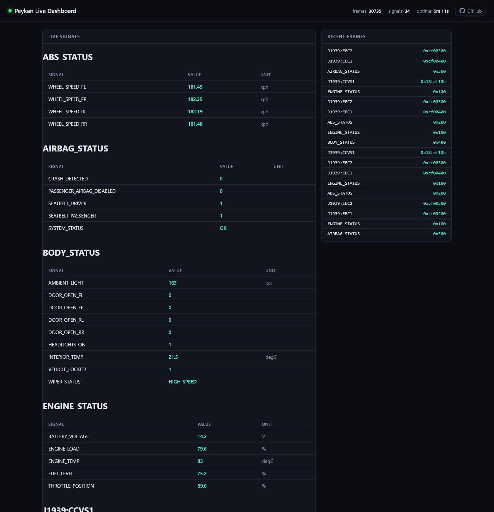

# 🚗 Peykan: Vehicle CAN Bus, OBD-II and J1939 Diagnostics for LLMs (Model Context Protocol)

🔌 Virtual CAN + MCP Server

> **Renamed:** this project was called **mcp-can** until 0.2.0. Install `peykan` instead of `mcp-can`, run `peykan` instead of `mcp-can` (the old command still works for now), and rename `MCP_CAN_*` environment variables to `PEYKAN_*` (the old names are still read, with a warning).

**Peykan** is a [Model Context Protocol](https://modelcontextprotocol.io) (MCP) server that exposes automotive **CAN bus**, **OBD-II** (SAE J1979), **UDS**, and **SAE J1939** diagnostic data to LLMs and AI agents. It ships a built-in **virtual CAN bus** with an **ECU simulator**, decodes traffic via a **DBC** database (`cantools`), and serves MCP tools over SSE or streamable-HTTP. No CAN hardware, adapter, or vehicle is required by default; optional SocketCAN/vCAN on Linux.

Use it to let an LLM read live CAN frames, decode signals, run OBD-II PID and UDS diagnostic requests, inspect J1939 PGNs/SPNs and DM1 trouble codes, and drive fault-injection scenarios against a simulated vehicle, analyse recorded CAN logs, or work with real hardware behind a read-only-by-default safety policy.

**Keywords:** MCP server, Model Context Protocol, CAN bus, CANbus, OBD-II, OBD2, on-board diagnostics, SAE J1939, UDS, ECU simulator, vehicle diagnostics, automotive, DBC, python-can, cantools, SocketCAN, LLM tools, AI agents.

---

## ✨ Highlights
- MCP server for CAN/OBD/UDS-diagnostics/J1939 → LLM/SLM (tools + DBC metadata, SSE or streamable-HTTP).
- Virtual CAN backend (python-can) out of the box; optional SocketCAN/vCAN on Linux.
- DBC-driven encoding/decoding via `cantools`.
- ECU simulator that streams multiple messages, plus OBD-II, UDS-style, and SAE J1939 responders.
- SAE J1939 (heavy-duty, 29-bit extended IDs): ID decomposition (priority/PGN/source+destination address), a curated PGN/SPN catalog (EEC1, EEC2, ET1, CCVS1, LFE1, DD1), Request PGN (`0xEA00`) round trips, and DM1 active-DTC (SPN/FMI) broadcasts. Runs alongside the 11-bit bus; toggle with `PEYKAN_J1939_ENABLED`.
- Correlated driving-dynamics signal generation, plus seven named fault-injection scenarios (`overheat`, `abs_fault`, `low_fuel`, `crash`, `door_ajar`, `misfire`, `battery_low`) that affect every protocol consistently and set matching DTCs.
- Real UDS (ISO 14229) over ISO-TP (ISO 15765-2) via `can-isotp` + `udsoncan`: VIN (OBD Mode 09), ReadDataByIdentifier, ReadDTCInformation with status bits, ClearDiagnosticInformation; J1939 multi-packet (BAM) transport for long DM1s.
- Recorded log analysis and replay: Vector `.asc`/`.blf`, PEAK `.trc`, candump `.log`, `.csv`. A sample drive recording ships with the package.
- Transmit safety for real hardware: read-only by default, write services opt-in, ID allowlist, audit log of every frame sent or blocked.
- Typer CLI: `peykan` (simulate, server, demo, frames, decode, monitor, dbc-info, obd-request, diag-request, fault, j1939-decode, j1939-pgns, j1939-request, j1939-dtcs, vin, uds-read, uds-dtcs, uds-clear, log-info, log-signal, replay, record).
- Structured tool output (typed Pydantic models), duration-capped tool calls, `/healthz`, colorized logging.
- Read-only live web dashboard (`/dashboard`): signal values and recent frames, updated over SSE.
- Dockerfile + docker compose for server + simulator.
- Unit tests, type hints, lint config (ruff, mypy); see `CONTRIBUTING.md`.

## 📁 Repository Layout
- `src/peykan/`
  - `cli.py` – Typer commands
  - `bus.py` – python-can helpers
  - `dbc.py` – DBC loading/decoding
  - `obd.py` – OBD-II (SAE J1979) request/response helpers
  - `diagnostics.py` – UDS-style diagnostic service/response-code logic
  - `j1939.py` – SAE J1939: 29-bit ID decomposition, PGN/SPN catalog, DM1 DTCs, Request PGN
  - `uds.py` – UDS over ISO-TP client helpers, DID/DTC/VIN decoding
  - `logs.py` – recorded log loading, analysis, replay and recording
  - `safety.py` – transmit policy + audit log (`TransmitGuard`)
  - `parsing.py` – int/hex ID parsing shared by tools and CLI
  - `config.py` – env settings (`PEYKAN_*`) + logging setup
  - `models.py` – internal bus-layer dataclass (`Frame`)
  - `simulator/runner.py` – ECU simulator + OBD/diagnostic responders
  - `simulator/j1939_runner.py` – J1939 broadcasters (EEC1/ET1/CCVS1/…), Request PGN responder, DM1 emitter
  - `simulator/state.py` – correlated driving-dynamics state (RPM/speed/throttle/etc.)
  - `simulator/faults.py` – named fault-injection presets + activation protocol
  - `simulator/uds_ecu.py` – simulated engine ECU answering UDS/OBD over ISO-TP
  - `server/mcp_server.py` – MCP tools/resources + dashboard routes
  - `server/prompts.py` – built-in MCP prompts + the instructions sent to clients
  - `server/schemas.py` – Pydantic models for MCP tool structured output
  - `server/live_state.py` – background bus listener backing the dashboard
  - `server/templates/dashboard.html` – the dashboard page itself
- `src/peykan/data/vehicle.dbc` – sample CAN database bundled with the package (incl. a UDS-like diagnostic schema)
- `src/peykan/data/sample_drive.asc` – bundled 30 s recording of a simulated drive with a misfire at 15 s
- `simulate-ecus.py`, `peykan-server.py` – standalone run-without-installing entrypoints
- `docker/compose.yml`, `Dockerfile`
- `tests/` – unit tests
- `CONTRIBUTING.md`, `CHANGELOG.md`

## ✅ Prerequisites
- Python 3.10+
- (Optional) Docker / Docker Compose
- (Optional) Ollama if you want a local LLM backend

## 📦 Install (Python)
From [PyPI](https://pypi.org/project/peykan/):
```bash
pip install peykan
peykan demo          # simulator + MCP server in one process, no hardware needed
```
Or run it without installing into your environment: `pipx run peykan demo` / `uvx peykan demo`.

The sample `vehicle.dbc` ships inside the package, so this works from any directory; point `PEYKAN_DBC_PATH` at your own DBC to use it instead.

From a checkout (for development):
```bash
pip install -e ".[dev]"
```

## 🚀 Quickstart (Simulator + MCP Server)
Two terminals:
```bash
# Terminal A: start ECU simulator on virtual bus0
peykan simulate

# Terminal B: start MCP server (SSE on 6278)
peykan server --port 6278
```

Single-process (helps on Windows if virtual backend doesn't share across processes):
```bash
peykan demo --port 6278
```

Sample interactions:
```bash
peykan frames --seconds 2
peykan decode 0x100 "01 02 03 04 05 06 07 08"       # pretty table by default, --json for scripting
peykan dbc-info                                      # table of every message/signal in the DBC
peykan monitor ENGINE_SPEED --seconds 3
peykan obd-request --service 0x01 --pid 0x0D
peykan diag-request --service-id 0x22 --parameter-id 0x05   # READ_DATA_BY_ID
peykan j1939-pgns                                            # J1939 PGN/SPN catalog
peykan j1939-request 0xF004                                  # ask ECUs to send EEC1 (engine speed)
peykan j1939-dtcs                                            # read the latest DM1 active-DTC broadcast
```

## 📊 Live Dashboard
With `peykan demo` (or `server`) running, open `http://localhost:6278/dashboard` in a browser: live signal values grouped by ECU message, and a scrolling feed of recent frames, updating ~2x/second over Server-Sent Events. It's read-only (view only, no controls to send frames) and self-contained: no build step, no external assets, works offline. Like everything bus-related here, it only shows data when the simulator shares the *same process* as the server (`peykan demo`); pointed at a bare `peykan server` with no simulator, it just shows "waiting for CAN traffic."



## 🛠️ Available MCP Tools, Prompts & Resources
| Name | Type | Description |
|---|---|---|
| `read_can_frames` | tool | Raw frames from the last `duration_s` seconds. Returns instantly (served from a continuously-running history buffer, not a fresh listen window). |
| `decode_can_frame` | tool | Decode one frame's bytes into named signals. |
| `filter_frames` | tool | Like `read_can_frames`, filtered by arbitration ID and/or signal. |
| `monitor_signal` | tool | Timestamped samples of one decoded signal, from the same history buffer. |
| `get_vehicle_snapshot` | tool | Last known value of every signal seen so far, one entry per signal (not per frame) with an `age_s` freshness indicator: a single-call overview instead of decoding a frame stream yourself. |
| `send_obd_request` | tool | Standard OBD-II (SAE J1979) request; decodes known PIDs (coolant temp, speed, fuel level, fuel type). |
| `send_diagnostic_request` | tool | UDS-style diagnostic request (`vehicle.dbc`'s `DIAGNOSTIC_REQUEST`); collects every ECU's response. |
| `activate_fault_scenario` | tool | Activate (or clear) a named fault-injection preset (`overheat`, `abs_fault`, `low_fuel`) in the running simulator; see below. |
| `decode_j1939_frame` | tool | Decompose a 29-bit J1939 ID (priority / PGN / source + destination address) and decode known SPNs from the payload. |
| `list_j1939_pgns` | tool | The J1939 PGN/SPN catalog this server can decode and request (bit layout, scaling, units). |
| `request_j1939_pgn` | tool | Send a J1939 Request PGN (`0xEA00`) and return the decoded responses (needs a simulator on this process's bus). |
| `read_j1939_dtcs` | tool | Most recent J1939 DM1 broadcast: lamp status plus every active SPN/FMI. Served from the frame history buffer. |
| `read_vin` | tool | VIN via OBD-II Mode 09 PID 02 (multi-frame ISO-TP), with check-digit validation. |
| `uds_read_data` | tool | UDS ReadDataByIdentifier (0x22) over ISO-TP, e.g. `0xF190` VIN, `0xF18C` serial, `0xF40C` RPM. |
| `uds_read_dtcs` | tool | UDS ReadDTCInformation (0x19): stored DTCs with status bits (present now vs. stored history). |
| `uds_clear_dtcs` | tool | UDS ClearDiagnosticInformation (0x14). A write service (see transmit safety). |
| `get_transmit_log` | tool | Transmit policy plus the most recent frames sent or blocked. |
| `list_can_logs` | tool | Log files in `PEYKAN_LOG_DIR`, plus the bundled `sample`. |
| `analyze_can_log` | tool | Summarise a recorded log: IDs and rates, signal ranges, DTCs, timing gaps. |
| `get_log_signal` | tool | One signal's values over a log, downsampled, with min/max/mean. |
| `replay_can_log` / `stop_log_replay` | tool | Replay a log onto the bus with original timing, so the live tools and dashboard work on it. |
| `dbc_info` | resource (`file://vehicle.dbc`) | Full DBC dump: nodes, messages, signals. |
| `diagnose_vehicle` | prompt | Health check: snapshot plus OBD-II and J1939 trouble codes, summarised with evidence and next steps. |
| `explain_dtc(code)` | prompt | Explain a trouble code (e.g. `P0217`) and check whether it's active right now. |
| `trip_summary(duration_s)` | prompt | Min/avg/max RPM, throttle and speed over the last few seconds. |
| `fault_drill(preset)` | prompt | Inject a simulated fault, diagnose it from the evidence alone, compare, then clear it. |
| `analyze_log(path)` | prompt | Investigate a recorded log and report a timeline and root cause. |

Prompts package multi-step tasks so smaller models don't have to plan the tool calls themselves; invoke them from your MCP client (in `ollmcp`, type `/diagnose_vehicle`). On connect, the server also sends clients short instructions on which tool answers which question (e.g. `get_vehicle_snapshot` for any current value).

`read_can_frames`/`filter_frames`/`monitor_signal`/`read_j1939_dtcs` are served from a single continuously-running history buffer (`server/live_state.py`) rather than each opening its own bus listener: they return immediately and won't miss frames sent between calls. `send_obd_request`/`send_diagnostic_request`/`request_j1939_pgn` are request/response and still wait live for a reply. In both cases, `duration_s`/`timeout_s` is capped by `PEYKAN_MAX_DURATION_S` (default 30s; the history buffer retains at least that much, or 60s, whichever is larger). All tools return typed, structured content (see `server/schemas.py`) rather than ad-hoc JSON.

### 🩺 About the diagnostic responder
`vehicle.dbc` defines a UDS-like diagnostic schema: `DIAGNOSTIC_REQUEST` (one shared request frame) and four `DIAGNOSTIC_RESPONSE_<ECU>` messages, one per ECU, but the request has no per-ECU target field. The simulator treats every request as functionally addressed to *all four* ECUs, so `send_diagnostic_request`/`diag-request` may return more than one response. Supported services: `START_DIAGNOSTIC_SESSION` (0x10) and `RESET_ECU` (0x11) are acknowledged OK; `READ_DATA_BY_ID` (0x22) returns a deterministic canned value derived from the parameter ID; `ROUTINE_CONTROL`/`READ_MEMORY`/`WRITE_MEMORY` and anything unrecognized return `SERVICE_NOT_SUPPORTED`; see `diagnostics.py::handle_service`.

### ⚠️ Fault injection
Named scenarios (`simulator/faults.py::PRESETS`) put the simulator into a specific fault state. Each one can override DBC signals and also change the underlying vehicle state, so the fault shows up consistently on the 11-bit signals, OBD-II, UDS and J1939 alike (a crash stops the vehicle everywhere, not just in one message).

| Preset | What happens | OBD/UDS DTC | J1939 DTC |
|---|---|---|---|
| `overheat` | Coolant temperature pinned at its maximum, airbag `SYSTEM_STATUS` = `FAULT_PRESENT` | `P0217` | SPN 110 FMI 0 |
| `abs_fault` | All four wheel speed sensors stuck at zero, `SYSTEM_STATUS` = `FAULT_PRESENT` | `C0035` | SPN 84 FMI 5 |
| `low_fuel` | Fuel level critically low (no DTC, as on a real vehicle) | – | SPN 96 FMI 18 |
| `crash` | Airbags deployed (`CRASH_DETECTED`), engine stalled and vehicle stopped, doors unlocked, driver door open, hazards on | `B0001` | – |
| `door_ajar` | Rear-right door reported open while driving | – | – |
| `misfire` | Engine speed rough and erratic, check-engine lamp on | `P0300` | SPN 1322 FMI 31 + SPN 651 FMI 7 (sent via BAM) |
| `battery_low` | Charging failure: about 11.3 V with the engine running | `P0562` | SPN 168 FMI 18 |

Activating a scenario sends a small control frame on the bus (like OBD/diagnostic requests, this is a round trip to whichever process is running the simulator, so it needs `peykan demo`/`simulate` already running) and overrides the named signals until cleared. Any DTCs the active scenario sets show up in `send_obd_request`/`obd-request`'s Mode 03 (service=3) response. Use `peykan fault list` or the `activate_fault_scenario` tool's docstring to see the current preset descriptions; pass `preset=None` (CLI: `clear`) to deactivate.

### 🚛 SAE J1939 (heavy-duty)
Alongside the light-vehicle 11-bit bus, the simulator also speaks **SAE J1939** — the protocol on trucks, buses and off-highway equipment. J1939 rides 29-bit *extended* CAN IDs whose arbitration field is itself structured data: a 3-bit priority, an 18-bit Parameter Group Number (PGN), and an 8-bit source address (plus, for peer-to-peer "PDU1" PGNs, a destination address). `src/peykan/j1939.py` is a self-contained implementation of that layer (not DBC-driven — `vehicle.dbc` models an 11-bit light-vehicle bus).

What's simulated (`simulator/j1939_runner.py`), driven by the same correlated driving-dynamics state as the 11-bit signals:

| PGN | Acronym | Contents |
|---|---|---|
| `0xF004` | EEC1 | Engine speed (SPN 190), actual engine percent torque (SPN 513) |
| `0xF003` | EEC2 | Accelerator pedal position (SPN 91), percent load (SPN 92) |
| `0xFEEE` | ET1 | Engine coolant temperature (SPN 110), fuel temperature (SPN 174) |
| `0xFEF1` | CCVS1 | Wheel-based vehicle speed (SPN 84) |
| `0xFEF2` | LFE1 | Engine fuel rate (SPN 183), throttle valve position (SPN 51) |
| `0xFEFC` | DD1 | Fuel level (SPN 96) |
| `0xFEF7` | VEP1 | Battery potential (SPN 168) |
| `0xFECA` | DM1 | Active diagnostic trouble codes (SPN + FMI), broadcast at 1 Hz |

- **Request PGN (`0xEA00`):** `request_j1939_pgn` / `peykan j1939-request <pgn>` send a request; the simulator re-broadcasts the requested PGN once.
- **DM1 / DTCs:** `read_j1939_dtcs` / `peykan j1939-dtcs` read the latest DM1. The fault-injection presets map to J1939 DTCs too — `overheat` → SPN 110 FMI 0, `abs_fault` → SPN 84 FMI 5, `low_fuel` → SPN 96 FMI 18 — and the malfunction-indicator lamp turns on while a preset is active.
- J1939 signals also appear in `get_vehicle_snapshot` and the dashboard, grouped under `J1939:<acronym>`.
- **Multi-packet transport (BAM):** a DM1 with two or more DTCs is longer than one frame, so it goes out as a TP.CM announcement plus TP.DT packets (J1939-21). The simulator sends it that way and every reader (`read_j1939_dtcs`, the CLI, log analysis) reassembles it.
- Set `PEYKAN_J1939_ENABLED=false` for an 11-bit-only bus.

### 🔧 UDS over ISO-TP
Classic CAN frames carry 8 bytes; a VIN, a DTC list or most UDS responses don't fit, so ISO-TP (ISO 15765-2) splits them into first/consecutive frames with flow control. Peykan uses [can-isotp](https://github.com/pylessard/python-can-isotp) for the transport and [udsoncan](https://github.com/pylessard/python-udsoncan) for the UDS client, and the simulator includes an engine ECU (`simulator/uds_ecu.py`) on the standard 11-bit IDs (request `0x7E0`, response `0x7E8`, functional `0x7DF`):

- **VIN:** `read_vin` / `peykan vin` (OBD Mode 09 PID 02, 20-byte multi-frame reply). The simulated VIN is `1MCAN00S0SM000042`.
- **Data identifiers:** `uds_read_data` / `peykan uds-read 0xF190 0xF40C` – `F187` part number, `F18C` serial, `F190` VIN, `F195` software version, and live `F405` coolant, `F40C` RPM, `F40D` speed, `F442` voltage.
- **DTCs:** `uds_read_dtcs` / `peykan uds-dtcs` report each code with ISO 14229 status bits. Like a real ECU, the simulator keeps history: an active fault is `test_failed` + `confirmed`; after it clears it stays `confirmed` until `uds_clear_dtcs` / `peykan uds-clear` (0x14). A fault that's still present is detected again immediately.
- Other ECUs: pass `request_id` / `response_id` (e.g. `0x7E1` / `0x7E9`).

## 📼 Recorded CAN logs
Most CAN data people want analysed is a recording, not a live car. Peykan reads Vector `.asc`/`.blf`, PEAK `.trc`, candump `.log` and `.csv` (and `.mf4` with `asammdf` installed) through python-can.

```bash
peykan log-info sample                       # IDs + rates, signal ranges, DTCs, timing gaps
peykan log-signal sample ENGINE_SPEED        # one signal over time (JSON)
peykan replay my_drive.blf --speed 2         # put it back on the bus
peykan demo --log my_drive.blf               # MCP server + dashboard on a looping recording
peykan record out.asc --simulate --fault misfire --fault-at 15 --seconds 30
```

From an MCP client: `list_can_logs`, `analyze_can_log`, `get_log_signal`, `replay_can_log`, or the `analyze_log` prompt. Clients can only read files under `PEYKAN_LOG_DIR` (default: the server's working directory) plus the bundled `sample`, a 30 s simulated drive with a misfire starting at 15 s. Signals are decoded with the configured DBC and the J1939 catalog, so set `PEYKAN_DBC_PATH` to your vehicle's DBC for your own recordings.

## 🔌 Real hardware & transmit safety
Point Peykan at a real adapter with `PEYKAN_CAN_INTERFACE`, `PEYKAN_CAN_CHANNEL` and `PEYKAN_CAN_BITRATE` (any [python-can interface](https://python-can.readthedocs.io/en/stable/interfaces.html) works; interface-specific options can also go in python-can's config file):

| Adapter | Interface | Channel example | Notes |
|---|---|---|---|
| Linux SocketCAN (incl. many USB adapters) | `socketcan` | `can0` | `sudo ip link set can0 up type can bitrate 500000`; bitrate is set on the link, not here |
| PEAK PCAN-USB | `pcan` | `PCAN_USBBUS1` | Needs the PCAN-Basic driver |
| Kvaser | `kvaser` | `0` | Needs Kvaser CANlib |
| Vector | `vector` | `0` | Needs Vector XL driver; set the application config in Vector Hardware Config |
| slcan (CANable, USBtin, ...) | `slcan` | `COM3` or `/dev/ttyACM0` | `pip install "peykan[serial]"` |

```bash
PEYKAN_CAN_INTERFACE=pcan PEYKAN_CAN_CHANNEL=PCAN_USBBUS1 PEYKAN_CAN_BITRATE=500000 peykan server
```

On anything other than the virtual bus the server is **read-only** until you opt in, because the tools are driven by an LLM:

| Setting | Default on hardware | Allows |
|---|---|---|
| `PEYKAN_ALLOW_TRANSMIT=true` | off | Requests that only read: OBD Mode 01/03/09, UDS 0x22/0x19, J1939 Request PGN |
| `PEYKAN_ALLOW_WRITE_SERVICES=true` | off | Also state-changing services: clearing DTCs, ECU reset, UDS writes/routines, log replay, fault injection |
| `PEYKAN_TRANSMIT_ALLOWLIST=["0x7DF","0x7E0"]` | none | Restricts transmitting to these arbitration IDs |
| `PEYKAN_TRANSMIT_LOG_PATH=tx.jsonl` | unset | Appends every frame sent or blocked as a JSON line |

Every frame goes through one guard, including the flow-control and consecutive frames ISO-TP sends on its own. Refused requests return status `"blocked"` with the reason, and `get_transmit_log` shows the policy and recent traffic. The simulator refuses to start on real hardware (it would flood a vehicle network with fake ECU traffic) unless `PEYKAN_SIMULATOR_ON_HARDWARE=true`, for isolated bench setups.

## 🔍 MCP Inspector (GUI for your tools)
Use the official Inspector to explore and call your MCP tools without writing a host:
```bash
npx @modelcontextprotocol/inspector
```
When prompted, connect to your server:
- URL: `http://localhost:6278/sse`

You can then list tools/resources and call one (e.g. monitor `ENGINE_SPEED` for 5 seconds) and view structured output live.

## 🤖 Using with Ollama (local LLM)
Ollama runs the model but can't connect to MCP servers on its own, so you need a small client in between. [`ollmcp`](https://github.com/jonigl/mcp-client-for-ollama) is the quickest option.

1. Pull a model that supports **tool calling** and fits in your GPU's memory, e.g. `ollama pull qwen3:8b` (about 5 GB). To check a model, run `ollama show <model>` and look for `tools` under *Capabilities*. Models without it (e.g. the original `llama3`) can chat but can't call the CAN tools.
2. Terminal A: start the simulator and server:
   ```bash
   peykan demo
   ```
3. Terminal B: install `ollmcp` and connect it:
   ```bash
   pip install ollmcp
   ollmcp -u http://localhost:6278/sse -m qwen3:8b
   ```
   `ollmcp` should list the 22 Peykan tools on startup. (Before 0.2.0, when this project was still `mcp-can`, it required the `mcp` 1.x SDK, which conflicts with `ollmcp`; from 0.2.0 both use 2.x and can share an environment.)
4. In the `ollmcp` chat, run these once (commands start with `/`):
   - `/tm` turns thinking mode off. With thinking on, answers take 20–60 s and `ollmcp` sometimes drops the tool call after thinking ("No Response from Model"). With it off, answers take a few seconds.
   - `/hil` stops the confirmation prompt before every tool call.
   - `/diagnose_vehicle` runs the built-in health-check prompt.
5. Ask questions in plain language. The chat talks to the model; it isn't a shell.
   - "What's the latest vehicle speed?"
   - "What's the engine speed and coolant temperature right now?"
   - "Read the OBD-II trouble codes."
   - "Activate the overheat fault, then read the J1939 DTCs."

Troubleshooting:
- **Stuck on "working..." or very slow:** check where the model runs with `ollama ps` while it answers. On laptops with both integrated and dedicated graphics, Ollama may choose the integrated GPU (it borrows system RAM, so it looks large), which is many times slower. Set `OLLAMA_VULKAN=0` to keep it on an NVIDIA GPU, and `OLLAMA_CONTEXT_LENGTH=8192` so the model fits in the GPU's memory. Then fully restart Ollama (on Windows, *Quit* from the tray icon and relaunch). On Windows: `setx OLLAMA_VULKAN 0` and `setx OLLAMA_CONTEXT_LENGTH 8192`.
- **Wrong tool or wrong IDs:** small models sometimes pick a roundabout tool. Name it ("use get_vehicle_snapshot"), or clear the context with `/cc`. Tools that take IDs (PGNs, CAN IDs, OBD PIDs, UDS services) accept hex strings like `"0xF004"` and J1939 acronyms like `"EEC1"`, so models don't have to convert hex to decimal (a common source of wrong requests).
- Watch the same signals live at `http://localhost:6278` while you chat.

Other MCP hosts work too: [Open WebUI](https://docs.openwebui.com/) can use Ollama models with MCP tools, and VS Code, Cursor, Windsurf and Claude Desktop can connect to `http://localhost:6278/sse` directly, using their own models.

## ⌨️ CLI Reference
- `peykan simulate` – start ECU simulator using the configured DBC (bundled `vehicle.dbc` by default).
- `peykan server [--host 127.0.0.1] [--port 6278] [--transport sse|streamable-http|stdio]` – run the MCP server.
- `peykan demo [--host] [--port] [--transport]` – simulator + server in one process.
- `peykan frames --seconds 1.0` – capture raw frames as JSON.
- `peykan decode <id> <data> [--json]` – decode a single frame (table by default; `id` hex/decimal, `data` space/comma-separated bytes).
- `peykan snapshot --seconds 1.0 [--json]` – latest value of every signal seen while listening.
- `peykan dbc-info [message]` – table of every message/signal in the DBC, or just one message's.
- `peykan monitor <signal> --seconds 2.0 [--json]` – watch one signal (live output by default).
- `peykan obd-request --service <hex|int> [--pid <hex|int>]` – OBD-II request; response includes a decoded value for known PIDs.
- `peykan diag-request --service-id <hex|int> [--parameter-id] [--data-field]` – UDS-style diagnostic request; prints every ECU's response.
- `peykan fault <preset|clear|list>` – activate/clear a fault-injection scenario in a running simulator, or list available presets.
- `peykan j1939-decode <id> <data> [--json]` – decompose a 29-bit J1939 ID and decode known SPNs.
- `peykan j1939-pgns` – list the J1939 PGNs/SPNs this project can decode.
- `peykan j1939-request <pgn> [--timeout 2.0]` – send a J1939 Request PGN (`0xEA00`) and print decoded responses; `pgn` can be an acronym (`EEC1`), hex (`0xF004`) or decimal.
- `peykan j1939-dtcs [--seconds 3.0]` – listen for a J1939 DM1 broadcast and print its active trouble codes.
- `peykan vin` – read the VIN (OBD Mode 09 over ISO-TP).
- `peykan uds-read <did>... [--request-id 0x7E0] [--response-id 0x7E8]` – UDS ReadDataByIdentifier.
- `peykan uds-dtcs [--status-mask 0xFF]` / `peykan uds-clear` – read / clear DTCs over UDS.
- `peykan log-info <file|sample> [--json]` / `peykan log-signal <file> <signal>` – analyse a recorded log.
- `peykan replay <file> [--speed 1.0] [--loop]` – replay a log onto the bus.
- `peykan record <file> [--seconds 30] [--simulate] [--fault <preset> --fault-at 10]` – record the bus to a log.
- `peykan demo --log <file>` – serve a looping recording instead of the simulator.

`server`/`demo`/`simulate` all print colorized logs (via `rich`) instead of raw text.

## ⚙️ Configuration
Env vars (prefix `PEYKAN_`):
- `CAN_INTERFACE` (default `virtual`)
- `CAN_CHANNEL` (default `bus0`)
- `CAN_BITRATE` (unset) – passed to python-can for real adapters
- `DBC_PATH` (default: the `vehicle.dbc` bundled with the package)
- `MCP_HOST` (default `127.0.0.1`) – interface the server listens on. The default only accepts connections from this machine, and the server rejects requests whose `Host` header isn't local (DNS-rebinding protection). Set `0.0.0.0` to accept connections from other machines; the tools have no authentication, so only do that on a trusted network or inside a container (the Dockerfile and compose file set it).
- `MCP_PORT` (default `6278`)
- `MCP_TRANSPORT` (default `sse`; also `streamable-http` (endpoint `/mcp`) or `stdio`)
- `MAX_DURATION_S` (default `30.0`) – caps every tool's `duration_s`/`timeout_s`
- `J1939_ENABLED` (default `true`) – run the SAE J1939 side of the simulator alongside the 11-bit signals
- `LOG_LEVEL` (default `INFO`)
- `CORS_ALLOW_ORIGINS` (default `["*"]`, JSON array e.g. `["https://your-host.example"]`) – allowed browser origins for the SSE endpoint. Credentialed requests (`allow_credentials`) are only enabled once this is narrowed to specific origins; wildcard + credentials is a combination browsers reject outright, so it's never turned on for the default `"*"`. Override before any real deployment.

- `ALLOW_TRANSMIT`, `ALLOW_WRITE_SERVICES`, `TRANSMIT_ALLOWLIST`, `TRANSMIT_LOG_PATH`, `SIMULATOR_ON_HARDWARE` – see *Real hardware & transmit safety*
- `LOG_DIR` (default `.`) – directory MCP clients may read CAN log files from

You can also set these in a `.env` file in the working directory.

## 🐳 Docker
Build:
```bash
docker build -t peykan .
```
Run (combined server + simulator):
```bash
docker run -d --name peykan -p 6278:6278 -p 5000:5000 -p 8080:8080 peykan
```
Compose (from `docker/`):
```bash
docker compose up -d --build
```
> The compose file currently runs `server` and `simulator` as separate containers; like running them as two separate local processes, they won't share the virtual CAN bus unless the host provides a real shared `vcan0` interface. For a working combined setup today, use the single-container Dockerfile above (`peykan demo`).

## 🧪 Development & Testing
See `CONTRIBUTING.md` for the full guide. Quick version:
```bash
pip install -e ".[dev]"

ruff check .
mypy src
pytest -q
```

## 🔧 Troubleshooting
- No frames? Ensure both simulator and server use the same interface/channel (`virtual`/`bus0` by default), and, on Windows, that they're the same process (`peykan demo`) rather than two separate ones.
- DBC missing? Unset `PEYKAN_DBC_PATH` to fall back to the bundled sample, or point it at an existing `.dbc` file.
- Docker networking: expose `6278` so your MCP host can reach it.
- Can't reach the server from another machine or container? It listens on `127.0.0.1` by default; set `PEYKAN_MCP_HOST=0.0.0.0` (or `--host 0.0.0.0`).
- Pinned to the old `mcp` 1.x SDK by another tool? `peykan` 0.2.0+ needs `mcp>=2.1.1`; use `peykan<0.2` with 1.x.

## 📄 License
MIT (see `LICENSE`). Educational/prototyping use only; use certified hardware for real automotive work.
