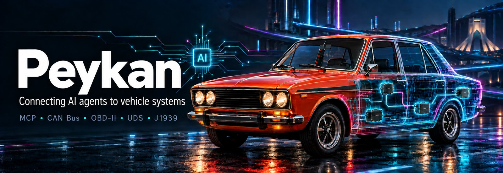

# Peykan

**Peykan** is a [Model Context Protocol](https://modelcontextprotocol.io) (MCP)
server that exposes automotive **CAN bus**, **OBD-II** (SAE J1979), **UDS**, and
**SAE J1939** diagnostic data to LLMs and AI agents.

It ships a built-in **virtual CAN bus** and **ECU simulator**, decodes traffic via
a **DBC** database using `cantools`, and serves MCP tools over SSE or
streamable-HTTP. No CAN hardware, OBD adapter, or physical vehicle is required by
default. Optional SocketCAN / vCAN on Linux.

- **Source code and full docs:** [github.com/farzadnadiri/peykan](https://github.com/farzadnadiri/peykan)
- **License:** MIT (educational and prototyping use)

## What it does

- Streams and decodes live **CAN frames** from a simulated multi-ECU bus.
- Runs **OBD-II PID** requests (coolant temp, vehicle speed, fuel level, fuel type)
  and **UDS-style diagnostic** services (`READ_DATA_BY_ID`, session control, ECU reset).
- Decodes **SAE J1939** 29-bit extended IDs: priority, PGN, source and destination
  address, a curated PGN/SPN catalog (EEC1, EEC2, ET1, CCVS1, LFE1, DD1), Request
  PGN round trips, and **DM1** active diagnostic trouble codes (SPN/FMI).
- Injects named **fault scenarios** (`overheat`, `abs_fault`, `low_fuel`,
  `crash`, `door_ajar`, `misfire`, `battery_low`) with matching DTCs.
- Speaks real **UDS over ISO-TP** (VIN, data identifiers, DTCs with status)
  and J1939 multi-packet transport.
- Analyses and replays **recorded CAN logs** (.asc, .blf, .trc, candump .log).
- Works on **real hardware** behind a read-only-by-default transmit policy.
- Serves a read-only live **web dashboard** of signal values and recent frames.

## MCP tools

`read_can_frames`, `decode_can_frame`, `filter_frames`, `monitor_signal`,
`get_vehicle_snapshot`, `send_obd_request`, `send_diagnostic_request`,
`activate_fault_scenario`, `decode_j1939_frame`, `list_j1939_pgns`,
`request_j1939_pgn`, `read_j1939_dtcs`, `read_vin`, `uds_read_data`,
`uds_read_dtcs`, `uds_clear_dtcs`, `get_transmit_log`, `list_can_logs`,
`analyze_can_log`, `get_log_signal`, `replay_can_log`, `stop_log_replay`, plus
the `vehicle.dbc` resource and built-in prompts (`diagnose_vehicle`,
`explain_dtc`, `trip_summary`, `fault_drill`, `analyze_log`).

## Quickstart

```bash
pip install peykan

peykan demo --port 6278          # simulator + MCP server in one process
# then point your MCP host at http://localhost:6278/sse
```

See the [README](https://github.com/farzadnadiri/peykan#readme) for the full CLI
reference, configuration, Docker setup, and Ollama integration.

## Topics

MCP server, Model Context Protocol, CAN bus, OBD-II, OBD2, on-board diagnostics,
SAE J1939, UDS, ECU simulator, vehicle diagnostics, automotive, DBC, python-can,
cantools, SocketCAN, LLM tools, AI agents.
